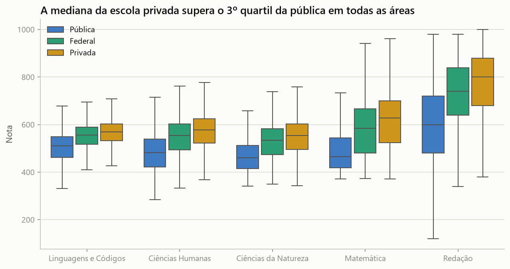
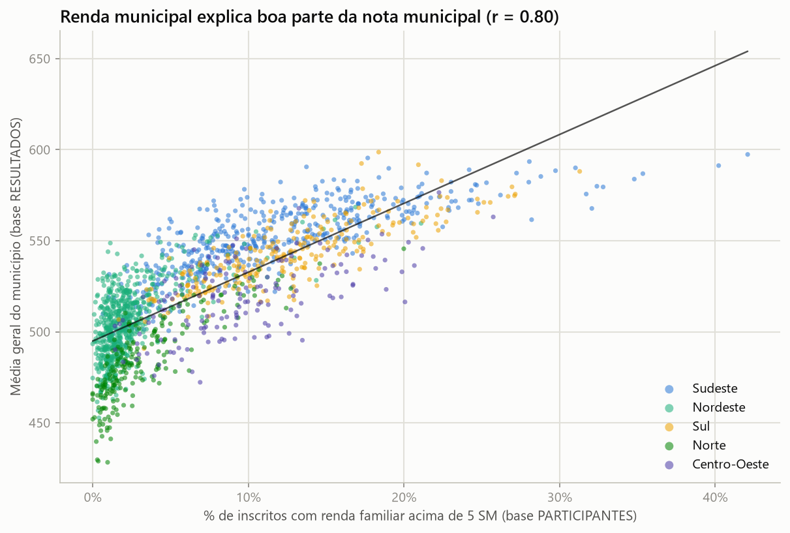
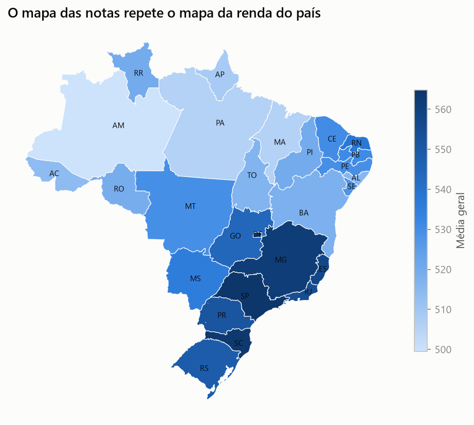
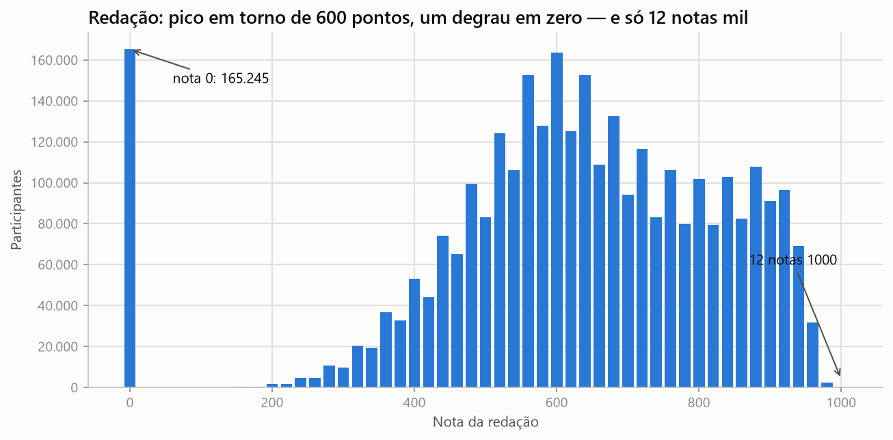
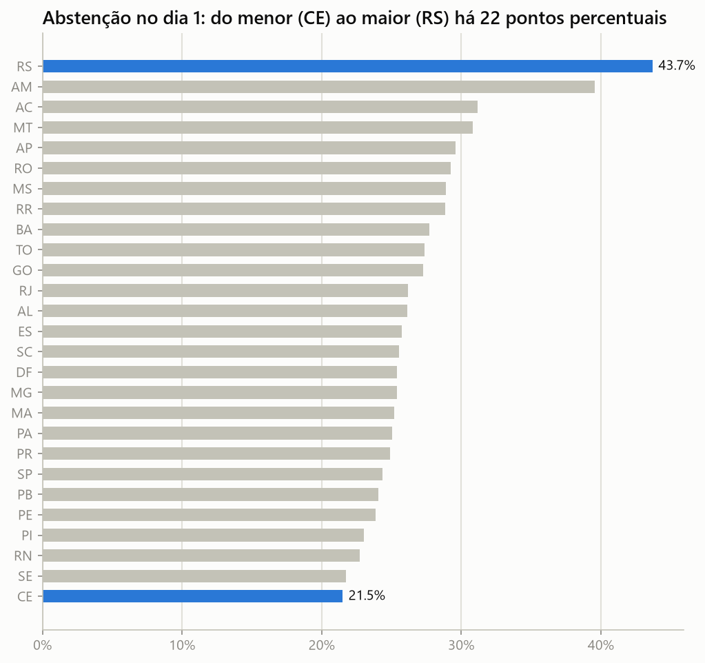

# ENEM 2024 — Análise Exploratória dos Microdados

[](https://github.com/Joao-Biazzin/Analise-dos-microdados-ENEM-2024/actions/workflows/ci.yml)

[](LICENSE)

> **EN summary** · Exploratory analysis of Brazil's 2024 national high-school exam (ENEM)
> microdata — 4.33 million candidates, 2.1 GB of raw CSVs processed with **DuckDB** straight
> from disk (no cluster, no pandas-on-raw-files). Since 2020 Brazil's data-protection law
> (LGPD) forced INEP to publish the socioeconomic questionnaire and the scores as **two
> unlinkable files**; this project embraces that constraint and answers the income–score
> question with an explicit **ecological analysis** at the municipality level (r ≈ 0.80),
> including a discussion of the ecological fallacy. Full narrative in Portuguese below.

Análise exploratória dos microdados oficiais do ENEM 2024 (INEP): **4.332.944 inscritos**,
2,1 GB de CSVs processados com DuckDB direto do disco. Seis perguntas definidas **antes** de
abrir os dados, quatro notebooks narrativos e uma restrição real de LGPD tratada de frente.

## As 6 perguntas — e as respostas em uma linha

| # | Pergunta | Resposta curta |
|---|----------|----------------|
| 1 | Quem presta o ENEM? | Jovem (44% com 17–18 anos), mulher (61%), preto/pardo (55%) e de baixa renda (42% das famílias vivem com até 1 salário mínimo) |
| 2 | Qual o tamanho da abstenção? | 26,8% no dia 1 e 30,6% no dia 2; no RS (enchentes de 2024) chegou a **43,7%**. E ela **não acompanha a renda municipal** (r ≈ −0,1): a desigualdade aparece na nota, não no comparecimento |
| 3 | Quão grande é o fosso público × privado? | De 63 pontos (Linguagens) a **192 pontos (Redação)**; a mediana da privada supera o 3º quartil da pública em todas as áreas |
| 4 | Como o desempenho se distribui no mapa? | O mapa das notas repete o mapa da renda: Sul/Sudeste no topo, interior do Norte/Nordeste na base |
| 5 | O que a redação revela? | 5,2% valem zero (principal motivo: folha em branco); só **12 notas 1000**; a competência que mais derruba é a **C5 (proposta de intervenção)** |
| 6 | Municípios mais ricos têm notas maiores? | Sim, e muito: **r ≈ 0,80** entre % de renda alta e média municipal — mas é uma correlação **ecológica** (leia as ressalvas) |

## Os 5 gráficos que resumem a análise











## A restrição que define o projeto (LGPD)

Desde 2020, o INEP publica os microdados **sem chave de ligação** entre o arquivo de
participantes (perfil + questionário socioeconômico) e o de resultados (notas) — o Leia-me
oficial de 2024 é explícito: *"as duas bases não possuem chave de ligação em comum"*.
Consequências práticas, documentadas nos notebooks:

- Não existe cruzamento **individual** renda × nota no ENEM desde então; análises que
  afirmam isso com dados 2020+ estão erradas.
- O único cruzamento válido é **agregado pelo município de prova**, presente nas duas bases.
- Correlações ecológicas (município) **não se transferem para indivíduos** — a falácia
  ecológica e os fatores compostos (escola privada, escolaridade da mãe, abstenção) são
  discutidos no notebook 04.

## Estrutura

```
├── notebooks/
│   ├── 01-perfil-participantes.ipynb        # quem presta o ENEM
│   ├── 02-desempenho-e-abstencao.ipynb      # abstenção, público × privado, TRI
│   ├── 03-redacao.ipynb                     # notas, zeros e competências
│   └── 04-geografia-e-analise-ecologica.ipynb  # mapas e renda × nota municipal
├── src/enem2024/
│   ├── config.py            # caminhos (env ENEM_DATA_DIR)
│   ├── data.py              # DuckDB: leitura dos CSVs + 15 agregados parquet
│   ├── labels.py            # dicionário oficial INEP transcrito em Python
│   ├── plots.py             # estilo e paleta (validada para daltonismo)
│   └── build_aggregates.py  # CLI: python -m enem2024.build_aggregates
├── tests/                   # pytest com fixtures no formato exato do INEP
├── reports/figures/         # PNGs finais (versionados)
└── data/processed/          # agregados parquet (~2 MB, versionados p/ reprodução)
```

**Por que DuckDB?** `RESULTADOS_2024.csv` tem 1,7 GB — desconfortável para o pandas ler
inteiro. O DuckDB lê os CSVs direto do disco (separador `;`, Latin-1) e materializa os 15
agregados usados nos notebooks em **~20 segundos**, reduzindo 2,1 GB para 2,2 MB de parquet.
Os notebooks nunca tocam nos arquivos brutos.

## Como reproduzir

**Caminho rápido (sem baixar os 2,1 GB):** os agregados parquet (~2 MB) estão versionados
em `data/processed/`, então os notebooks rodam direto do clone — requer só o
[uv](https://docs.astral.sh/uv/):

```bash
uv sync
uv run pytest            # testes (fixtures sintéticas, não precisam dos dados)
uv run jupyter lab       # execute notebooks/01 a 04 em ordem
```

O notebook 04 baixa as malhas do IBGE (~6 MB) na primeira execução. O CI executa os
notebooks 01–03 a cada push, exatamente por esse caminho.

**Para regerar os agregados do zero:** baixe os
[Microdados do ENEM 2024 (INEP)](https://www.gov.br/inep/pt-br/acesso-a-informacao/dados-abertos/microdados/enem),
descompacte, aponte a variável `ENEM_DATA_DIR` para a pasta descompactada (a que contém
`DADOS/`) e rode `uv run python -m enem2024.build_aggregates` (~20 s com DuckDB).

Validação: os agregados reproduzem os números divulgados pelo INEP — 4.332.944 inscritos,
abstenção de ~27% no dia 1 e exatamente **12 notas 1000** na redação.

## Limitações e próximos passos

- **Sem vínculo individual** entre questionário e nota (LGPD) — toda a seção socioeconômica
  × desempenho é ecológica, no nível de município.
- A dependência administrativa da escola vem do Censo Escolar 2024 e só existe para
  prováveis concluintes localizados no Censo; treineiros e egressos antigos ficam sem escola.
- As médias municipais de municípios pequenos são instáveis; os cortes (≥30 e ≥100
  participantes completos) estão explícitos nos notebooks.
- A regressão múltipla municipal (nb04) é descritiva: os preditores são colineares
  (renda × escolaridade da mãe: r = 0,88) e nada ali é efeito causal.
- Próximos passos: comparar com edições anteriores (2019–2023) e explorar os parâmetros
  TRI item a item.

## Fonte e citação

> INSTITUTO NACIONAL DE ESTUDOS E PESQUISAS EDUCACIONAIS ANÍSIO TEIXEIRA.
> *Microdados do Enem 2024*. Brasília: Inep, 2025.
> Disponível em: <https://www.gov.br/inep/pt-br/acesso-a-informacao/dados-abertos/microdados/enem>.

Projeto de portfólio de João Biazzin, desenvolvido com apoio do Claude Code.
